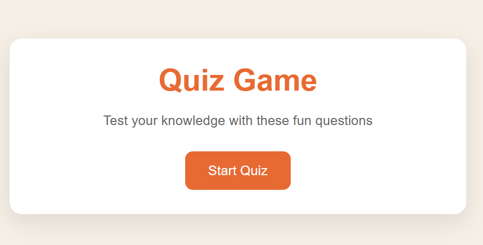
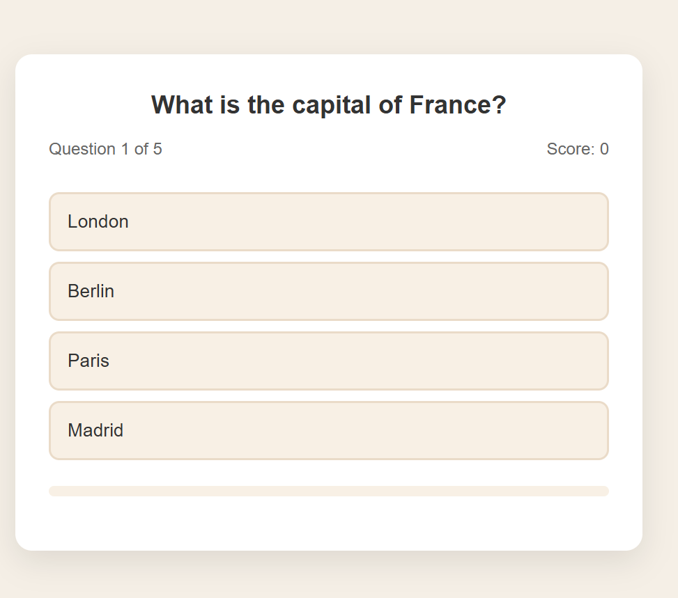
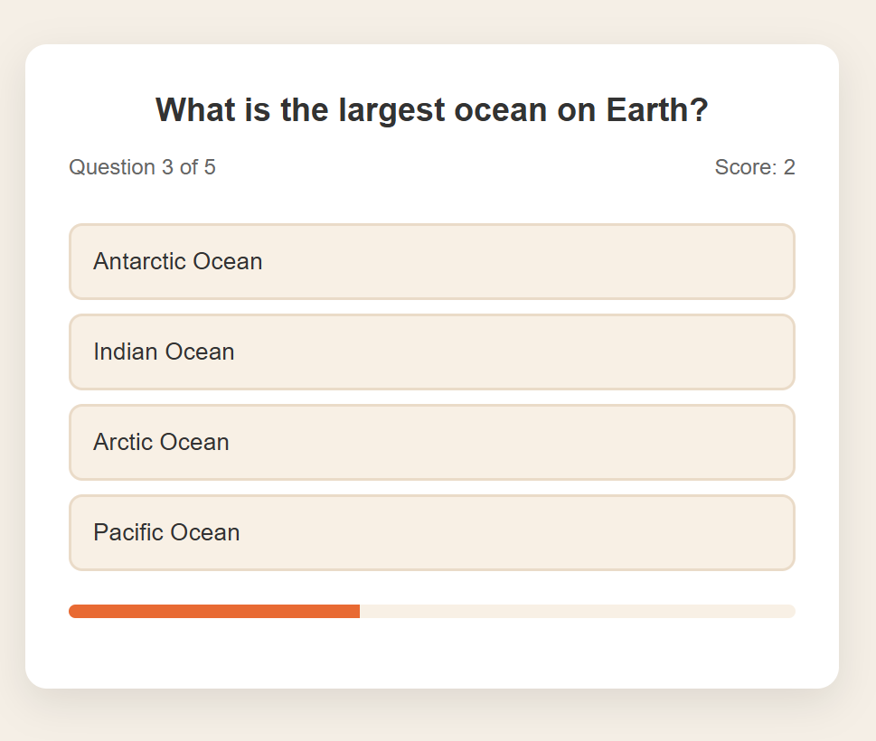
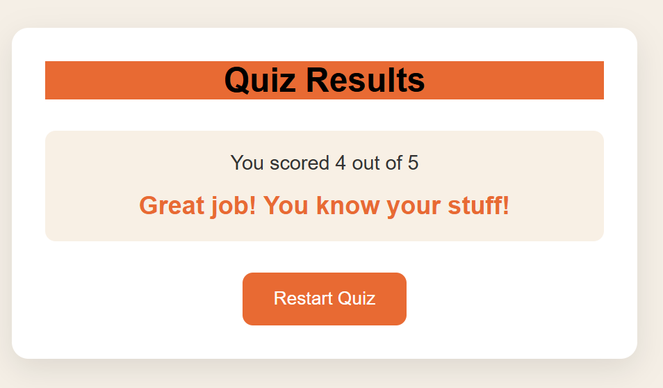

# 🧠 Interactive Quiz Web Application

A high-performance, fully responsive Quiz Web Application designed to provide a seamless user experience. This project demonstrates modern front-end development practices, including **Dynamic DOM Manipulation**, **State Management**, and **Asynchronous UI Updates**.

---

## 🚀 Live Demo
Experience the application live here:  
https://dhruti05.github.io/quiz-web-app/Quiz-Game/index.html

---

## 📸 Project Showroom

| Start Screen | Question Interface 1 |
| :---: | :---: |
|  |  |
| **Question Interface 2** | **Final Results Summary** |
|  |  |

---

## ✨ Key Features

* **State-Driven UI:** The application manages the quiz flow (Start -> Quiz -> Results) dynamically without page reloads.
* **Real-Time Progress Tracking:** A custom-engineered CSS progress bar calculates completion percentage based on the question index.
* **Instant Feedback System:** Uses dynamic class injection to highlight correct (green) and incorrect (red) answers immediately upon selection.
* **Scoring Algorithm:** Calculates final performance and delivers personalized motivational messages based on the score threshold.
* **Fully Responsive:** Hand-crafted Media Queries ensure a "Mobile-First" experience, looking great on smartphones, tablets, and desktops.

---

## 🛠️ Technical Deep Dive

### 🏗️ Architecture
The app follows a modular logic structure:
1.  **Data Layer:** Questions are stored in a structured Array of Objects, making it easy to add or edit questions.
2.  **Logic Layer:** JavaScript handles the "Quiz State" (Current Question, Current Score, and UI Locking).
3.  **Presentation Layer:** Clean HTML5 structure styled with Flexbox for perfect element alignment.

### 💻 Concepts Applied
* **Event Delegation:** Efficiently handling user clicks on dynamically generated buttons.
* **DOM Manipulation:** Using `innerHTML` and `appendChild` to refresh the UI content.
* **Dataset API:** Utilizing `data-correct` attributes to keep logic separated from the styling.
* **Timer Functions:** Using `setTimeout` to provide a brief "pause" for the user to see feedback before the next question appears.

---

## 🔧 Installation & Local Setup

To run this project on your local machine:

1.  **Clone the repository:**
    ```bash
    git clone [https://github.com/](https://github.com/)[Dhruti05]/quiz-web-app.git
    ```
2.  **Navigate to the project directory:**
    ```bash
    cd quiz-web-app
    ```
3.  **Launch the application:**
    Open `index.html` in your preferred web browser or use the **VS Code Live Server** extension for real-time updates.

---

## 🌟 Future Roadmap
- [ ] Implement a **Countdown Timer** for increased difficulty.
- [ ] Add a **Leaderboard** using `localStorage` to save high scores.
- [ ] Include **Sound Effects** for correct/incorrect answers.
- [ ] Support for **Multiple Categories** (Science, History, Tech).

---

## 🤝 Contributing
Contributions are what make the open-source community such an amazing place to learn, inspire, and create. Any contributions you make are **greatly appreciated**.

1. Fork the Project
2. Create your Feature Branch (`git checkout -b feature/AmazingFeature`)
3. Commit your Changes (`git commit -m 'Add some AmazingFeature'`)
4. Push to the Branch (`git push origin feature/AmazingFeature`)
5. Open a Pull Request

---

**Developed with 🧡 by Dhruti** *Connect with me on GitHub!*
